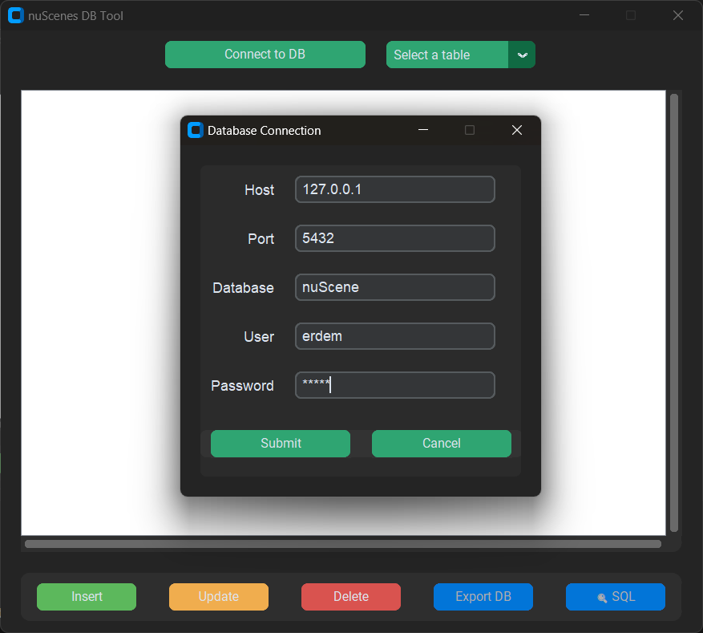
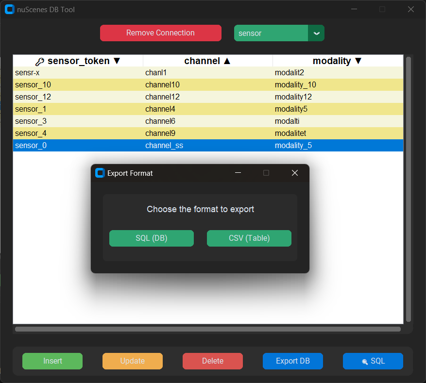
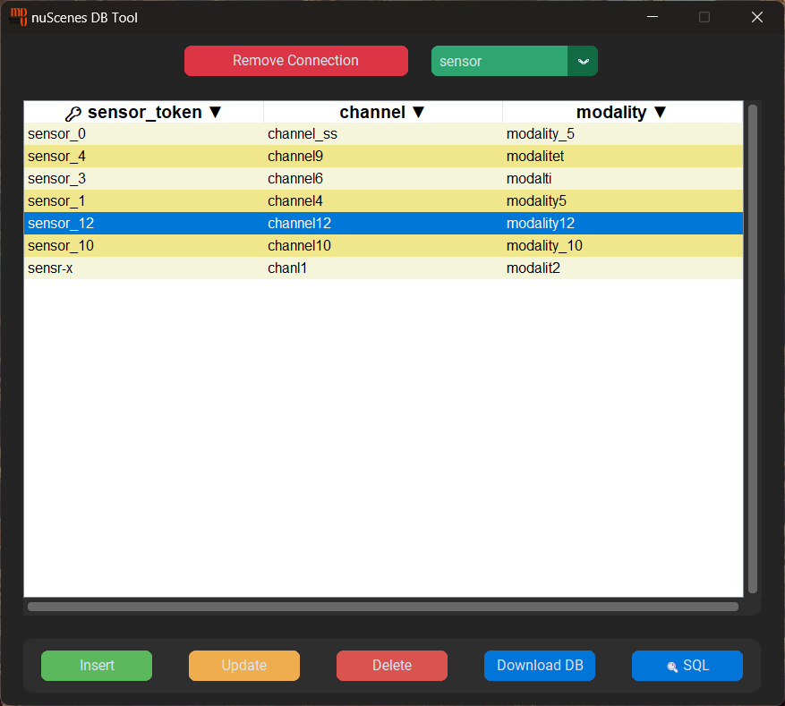
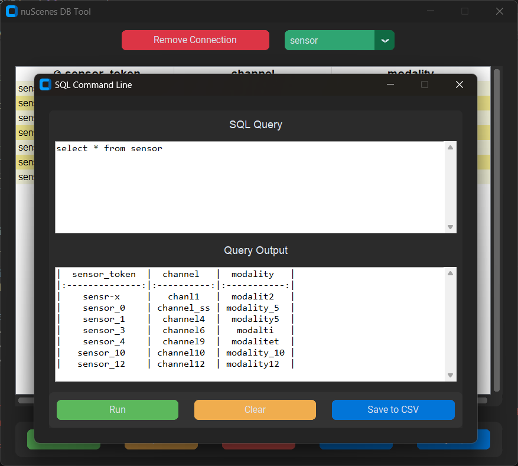
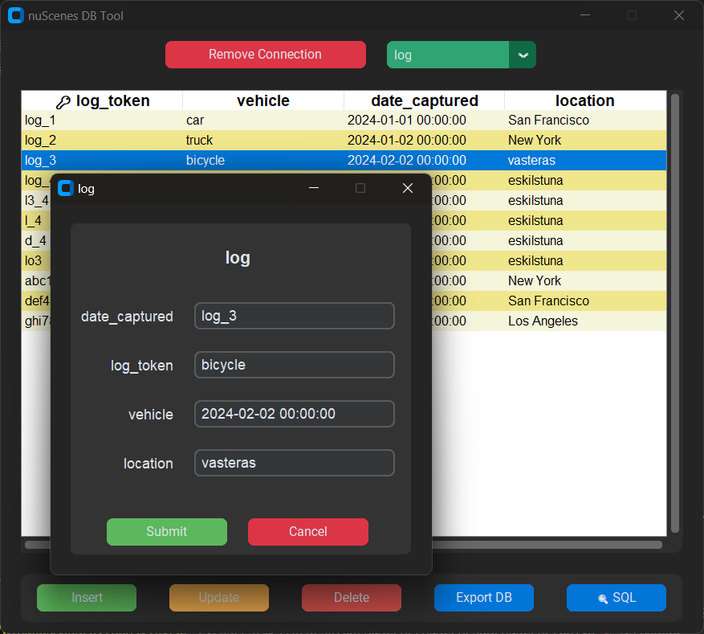

# nuScenes DB Tool - v1.0.0

**nuScenes DB Tool** is a Python-based graphical tool for PostgreSQL database management. This tool features an intuitive GUI for performing CRUD operations (Create, Read, Update, Delete), SQL query execution, and data export in SQL or CSV formats. Additionally, you can now import data from CSV files and update records seamlessly. The application is also packaged as an executable for easy distribution.

## Features

- **Connect to PostgreSQL**: Easily connect to a PostgreSQL database by entering the necessary credentials.
- **CRUD Operations**: Perform create, read, update, and delete operations on database records.
- **SQL Query Execution**: Run custom SQL queries directly within the app and view results.
- **Data Export**: Export table data or the entire database in SQL or CSV format.
- **CSV Import**: Import data into tables from CSV files.
- **GUI Enhancements**: Use a modern interface with sorting and easy navigation through tables.
- **Executable**: Available as a packaged executable under releases for easy installation.

## Table of Contents

- [Features](#features)
- [Installation](#installation)
- [How to Use](#how-to-use)
- [Screenshots](#screenshots)
- [Releases](#releases)
- [License](#license)

## Installation

### Option 1: Running the Executable (Recommended)

1. Download the latest release: [nuScenes DB Tool - v1.0.0](https://github.com/erdemonal11/nuScenesDB/releases/tag/exe-release).
2. Extract the files and run the `nuScenes DB Tool - v1.0.0.exe`.

### Option 2: Running from Source

1. Clone the repository:

   ```bash
   git clone https://github.com/erdemonal11/nuScenesDB.git
   cd nuscenes-db-tool
   ```


2. Install dependencies:
   ```bash
    pip install -r requirements.txt
    ```
3. Run the Python script:
   ```bash
    python nuscenetool.py
    ```

## How to Use

### Connect to Database:
1. Open the application and click **Connect to DB**.
2. Enter the PostgreSQL database credentials (Host, Port, Database, User, and Password).
3. Once connected, tables will appear in the dropdown for selection.

### CRUD Operations:
- **Insert**: Manually insert records or import from a CSV file.
- **Update**: Select a record from the table and click **Update** to modify it.
- **Delete**: Select a record and click **Delete** to remove it.

### SQL Query Execution:
- Use the **SQL** tool to write and execute custom queries.
- View the query output and export the results in CSV format.

### Export Data:
- Click **Export DB** to export either a specific table or the entire database in CSV or SQL format.

### CSV Import:
- Use the **CSV import** feature to load data into the selected table from a CSV file.

## Screenshots

### 1. Connection and UI
The interface allows you to easily connect to a PostgreSQL database by providing the necessary credentials. After connecting, available tables are listed in the dropdown.



### 2. Download Format
After selecting a table, you can export the data in SQL or CSV format.



### 3. Table Data
View, sort, and interact with the table data. You can perform CRUD operations on the records.



### 4. SQL Query Tool
Execute custom SQL queries and view the output directly in the tool.



### 5. Record Update
Use the **Update** feature to modify existing records directly from the table view.



## Releases

The latest version of the tool is available as an executable for easy installation:

- [Download nuScenes DB Tool - v1.0.0](https://github.com/erdemonal11/nuScenesDB)

## License

This project is licensed under the MIT License. See the [LICENSE](./LICENSE) file for more details.

